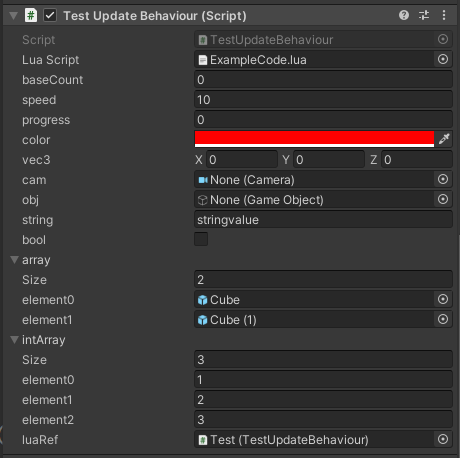

# EasyLua

EasyLua 是一个依赖于[xlua](https://github.com/Tencent/xLua)的lua运行模块，目的是用最符合unity使用习惯的方式来写lua代码。

EasyLua is a lua module based on [xlua](https://github.com/Tencent/xLua) project. It is created for writing lua scripts in unity more like writing C# scripts. 

## 为什么使用EasyLua? Why use EasyLua?
如果你想:
* 像编写C#一样编写lua脚本
* 编写纯lua驱动或者部分lua驱动的游戏
* 简单快速的编辑体验

If you want:
* writing lua scripts in unity as easy as writing C# scripts
* writing fully or partially lua driven game in unity
* easy and fast game editing experiences


## 简介 Introduction

基本的脚本写法与c#几乎相同。

Similar syntax to c# scripts.

```Lua
  ---@class LuaBehaviour:LuaObject
  ---@field private gameObject UnityEngine.GameObject
  ---@field private transform UnityEngine.Transform
  LuaBehaviour = {}

  function LuaBehaviour:Awake()
     print("hellow world")
  end
```

* 支持编辑器拖拽字段引用，与Mono脚本使用方法一致。
* Support drag&drop gameObject references.

* 支持基于继承的类型系统。
* Support a type system based on inheritance.

* 配合emmylua插件实现语法分析，支持VSCode和JetBrains的IDE。
* Support syntax analysis provided by emmylua addon which is supported on both VSCode and JetBrians IDE.

## 示例 example

在示例场景EasyLuaExample场景中(位于/EasyLua/Examples下) 可以找到示例用法，基本上就是将lua代码文件拖到EasyBehaviour(或继承自EasyBehaviour的脚本,示例中是TestUpdateBehaviour)脚本的LuaScript中，就可以像写C#脚本一样写lua脚本了，在Lua中声明的字段会同步在EasyBehaviour中显示。

You can find examples under folder /EasyLua/Examples. Basiclly, You can drag a lua script to EasyBehaviour's (or class that inherit from EasyBehaviour,for example,TestUpdateBehaviour) **luaScript** field. Then you can write the lua script just like a common  C# script, and fields changed in lua script will be reflected in EasyBehaviour.

```Lua
---@class ExampleCode:ExampleBaseClass
---@field public speed number
---@field public progress System.Single
---@field public color UnityEngine.Color
---@field public vec3 UnityEngine.Vector3
---@field public cam UnityEngine.Camera
---@field public obj UnityEngine.GameObject
---@field public string System.String
---@field public bool System.Boolean
---@field public array UnityEngine.GameObject[]
---@field public intArray System.Int32[]
---@field public luaRef ExampleCode
ExampleCode = {}

function ExampleCode:Ctor()
    print("call from Constructor")
    self.speed = self.speed or 0
end

function ExampleCode:Awake()
    print("call from awake")
    print(self.string)
end

function ExampleCode:Start()
    self:LuaReference()
end

function ExampleCode:OnEnable()
    self:NewClassExample()
end

function ExampleCode:Rotate()
    local r = CS.UnityEngine.Vector3.up * CS.UnityEngine.Time.deltaTime * self.speed
    self.transform:Rotate(r)

    for i = 0, self.array.Length - 1 do
        self.array[i].transform:Rotate(r)
    end
end

function ExampleCode:Update()
    self:Rotate()
end

function ExampleCode:PrintClassName()
    ExampleBaseClass.PrintClassName(self)
    print("call form ExampleCode")
end

function ExampleCode:LuaReference()
    print("lua class reference:------------Start")
    self.luaRef:PrintClassName()
    print("lua class reference:------------End")
end

function ExampleCode:NewClassExample()
    ---@type ExampleNewClass
    local class = NewClass(ExampleNewClass, "this is newClass")
    print(class:GetStringValue())
end

```


