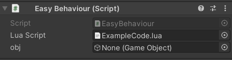

# EasyLua tutorial

## Dependencies
First of all, [xlua](https://github.com/Tencent/xLua) project is required, you need to include xlua in your project.

## Create a lua script

Right click a folder then click <b>Create->LuaClass</b> to create a lua script and give it a name,for instance "ExampleCode",

## Write some lua code

Open the lua script in your code editor, you will see:
```Lua
    ---@class ExampleCode
    ExampleCode= {}
```

* A class declaration must on the top of the script. It starts with "---@class" and followed with class name.
If there are multiple classe declararions in one single script , you need to use EasyLua built-in function <b>RegClass</b>
to Register Classes other than the first one.

```Lua
    RegClass(class,className,superClassName)
```
```Lua
    ---@class ExampleCode
    ExampleCode= {}

    ---@class OtherClass
    OtherClass= {}
    RegClass(OtherClass,"OtherClass","LuaObject")
```

* And you can specify the super class of a class ,the syntax is "class:superClass". all classes implictly inherit from LuaObject.

```Lua
    ---@class ExampleCode:LuaObject
    ExampleCode= {}

    ---@class OtherClass
    OtherClass= {}
    RegClass(OtherClass,"OtherClass","LuaObject")
```


* Declare fields just below the class declaration,the field declaration must starts with "---" and then followed with "@field"
 and continue with a modifier then the field name ,and finally, the type of the field. The field can be a C# type or a lua type.
  
  A modifier could be "public" or "private". if it's public , it will be displayed in inspector of EasyBehaviour.

  For example "---@field public obj UnityEngine.GameObject"

```Lua
    ---@class ExampleCode
    ---@field public obj UnityEngine.GameObject
    ---@field private luaNumber number
    ExampleCode= {}
```



* After declaration,you can write funcions of the script. and don't forget drag references in script's inspector.

```Lua
    ---@class ExampleCode
    ---@field public obj UnityEngine.GameObject
    ---@field private luaNumber number
    ExampleCode= {}

    function ExampleCode:Awake()
        print("obj Name is:" self.obj.name)
    end  
```

* Using EasyBehaviour directly is not recommended. Just inherit it and make your own behaviour class, that could be more versatile.
for example:

```C#
    public class LuaBehaviour : EasyBehaviour {
        public void CallLua(string funName, params object[] args) {
            CallLuaFun(funName, args);
        }

        protected override void Awake() {
            base.Awake();
            CallLuaFun("Awake");
        }

        protected virtual void Start() {
            CallLuaFun("Start");
        }

        protected virtual void OnEnable() {
            CallLuaFun("OnEnable");
        }

        protected virtual void OnDisable() {
            CallLuaFun("OnDisable");
        }

        protected virtual void OnDestory() {
            CallLuaFun("OnDestory");
        }
    }
```


## Load lua scripts

* You need to load your script to EasyLuaGlobal , Use the C# method <b> LoadClass </b> as below.

  a script needs to be loaded before using it.

```C#
    EasyLuaGlobal.Get().LoadClass(string script)
```

* In most cases , load all lua scripts in advance would be a better choice. for example:

```C#

    private void Awake() {
        StartCoroutine(CoLoadClass());
    }

    /// <summary>
    /// load all lua scripts at runtime
    /// </summary>
    IEnumerator CoLoadClass() {
        TextAsset[] assets = GetLuaFiles();
        for (int i = 0 ; i < assets.Length ; i++) {
            try {
                EasyLuaGlobal.Get().LoadClass(assets[i].text);
            } catch (Exception e) {
                Debug.LogError("error whild loading lua scripts" + assets[i].name);
                throw;
            }
            if (i%20 == 0) {
                yield return new WaitForEndOfFrame();
            }
        }
    }

    private TextAsset[] GetLuaFiles() {
        var folder = new string[] { "Assets/EasyLua/Examples/Code" };
        var assets = AssetDatabase.FindAssets("t:TextAsset", folder);
        var codes = assets.Select((g) => {
            var path = AssetDatabase.GUIDToAssetPath(g);
            return AssetDatabase.LoadAssetAtPath<TextAsset>(path);
        });
        return codes.ToArray();
    }
```

## Debug scripts
For debugging, [VSCode-EmmlyLua](https://github.com/EmmyLua/VSCode-EmmyLua) and [IntelliJ-EmmyLua](https://github.com/EmmyLua/IntelliJ-EmmyLua) are both good choices. 

EasyLua can work with EmmlyLua plugin properly.First,Installing EmmyLua on VScode (or intelliJ IDE) and include [emmyluaDebugger](https://github.com/EmmyLua/EmmyLuaDebugger/releases) in your project
(for window x64 system, put it under "Assets/ThirdPlugins/EmmyLua/Editor/x64/"),then adding a text file called "luaDebugConfig.txt" in unity project root folder(same level as Assets folder)
and paste the code below to that txt file. 

```Lua
if CS.UnityEngine.Application.platform == CS.UnityEngine.RuntimePlatform.WindowsEditor then
    xpcall(function()
        package.cpath = package.cpath .. ';' .. CS.UnityEngine.Application.dataPath .. '/ThirdPlugins/EmmyLua/Editor/x64/emmy_core.dll'
        local dbg = require('emmy_core')
        dbg.tcpConnect('localhost', 9966)
    end, function(err)
    end)
end
```

The next step is creating a lua debugger in you IDE. After this, open the launch settigns, change the port number to 9966,and set the "ideConnectDebugger" option to false.

```Json
{
    "launch": {
            "version": "0.2.0",
            "configurations": [
                {
                    "type": "emmylua_new",
                    "request": "launch",
                    "name": "EmmyLua New Debug",
                    "host": "localhost",
                    "port": 9966,
                    "ext": [
                        ".lua",
                        ".lua.txt",
                        ".lua.bytes"
                    ],
                    "ideConnectDebugger": false
                }
            ]
}
```
And finally, start debugging in the IDE and then run unity editor. If everything going ,you'll see "connected" on your IDE console,
that means debugger is working properly.


## Advanced Features

### built-in fields:
* you can access EasyBehaviour(or subclass of EasyBehaviour) instance through <b>self.this</b> in a lua script,
 as well as transfrom and gameObject using <b>self.transform</b> and <b>self.gameObject</b> respectively.


### custom field painter:

* you can draw your own lua type by inheriting EditorBasicFieldPainter and using CustomFieldPainter attribute ,
for example, the color type:
```C#
    [CustomFieldPainter("UnityEngine.Color")]
    public class EditorColorPainter : EditorBasicFieldPainter {
        public override bool Draw(EasyLuaParam para) {
            return DrawColor(para);
        }

        private bool DrawColor(EasyLuaParam para) {
            var val = para.ValueObject;
            if (!(val is Color)) {
                val = Color.white;
            }

            var prev = (Color)val;
            var newVal = EditorGUILayout.ColorField(para.name, prev);
            if (prev != newVal) {
                para.ValueObject = newVal;
                return true;
            }

            return false;
        }

    }

```

